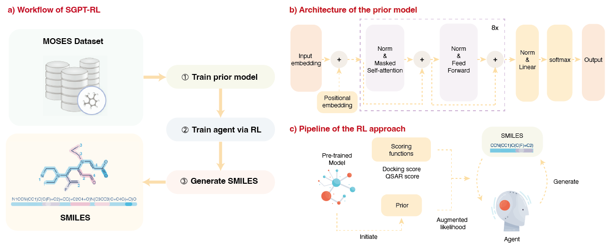

# Optimization of binding affinities in chemical space with transformer and deep reinforcement learning

This is the code of **SGPT-RL**, a tool for chemical design using transformer and deep reinforcement learning. Through employing GPT model as the policy network, SGPT-RL can learn scaffolds patterns in exploring the chemical space.




## Installation
### Create environment
```shell
conda env create -f environment.yml
conda activate sgpt-env
```
### Install Openbabel
```shell
sudo apt-get install -y openbabel
```
Need to remove the default `openbabel` in the conda environment if there's one.

## Running the code
Download the datasets to train the prior model, pretrained prior and agent models, and the generated molecules from [Google Drive](https://drive.google.com/drive/folders/1HmlysSSg9umTQ4BpudWj8iqYW8QT1S95?usp=sharing).

Commands to retrain the models & generate molecules:
```shell

# Train prior on Moses dataset
python train_prior.py --train_data data/moses/train.csv --valid_data data/moses/test.csv --n_epochs 10 --output_dir result/prior/moses/10epochs/ --eval --n_embd 256 --n_head 8 --n_layers 8 --batch_size 1024

# Train an agent to optimize DRD2 activity
python train_agent.py -p data/models/gpt_model_10_0.126.pt -a data/models/gpt_model_10_0.126.pt  -o result/agent/drd2/alone/sigma60- -t drd2 --sigma 60

# Train an agent to optimize ACE2 docking score
python train_agent.py -p data/models/gpt_model_10_0.126.pt -a data/models/gpt_model_10_0.126.pt  -o result/agent/ace2/alone/sigma60- -t ace2 --sigma 60  --n_steps 1000

# Generate molecules from pretrained models
python generate.py --model_path data/models/gpt_model_10_0.126.pt --out_file result/prior/moses/sgpt-30000.csv --num_to_sample 30000

```

## Acknowledge

Some codes are adapted from other sources, so special thanks to:
* [GuacaMol](https://github.com/BenevolentAI/guacamol) and [Guacamol_baselines](https://github.com/BenevolentAI/guacamol_baselines)
* [MolScore](https://github.com/MorganCThomas/MolScore)
* [MOSES](https://github.com/molecularsets/moses)
* [MinGPT](https://github.com/karpathy/minGPT)

## License

This code is licensed under [Apache License 2.0](./LICENSE).
